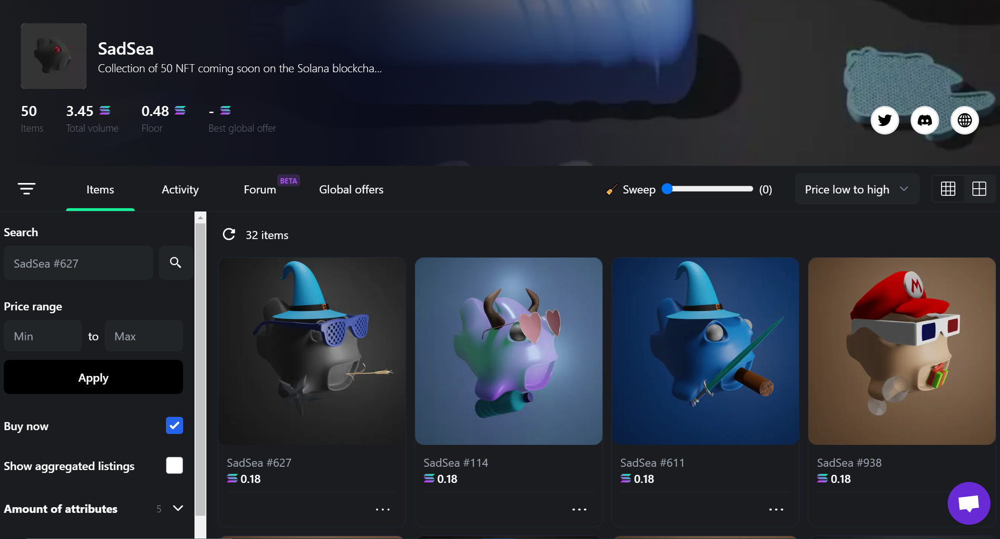

# Sadsea

 

This involves the design of a series of 4444 NFTs on the Solana blockchain, with the primary goal of preserving marine life and eliminating plastic pollution in the oceans. The project encompasses various aspects:

 

### NFT Design:

 

Creation of a series of 4444 NFTs (non-fungible tokens) on the Solana blockchain with visuals dedicated to the preservation of marine life and the fight against plastic pollution in the oceans. Each NFT represents a unique and valuable piece of art, recorded immutably on the blockchain.

 

### Landing Page Development:

 

Establishment of an interactive landing page developed in HTML/JS. The landing page serves as a virtual showcase, highlighting the NFT concept, explaining the environmental objective of the project, and encouraging visitors to engage in the initiative.

 

### Responsive Design with Vanilla CSS:

 

Design of a responsive and aesthetic layout using Vanilla CSS. This approach ensures an optimal user experience on various devices without relying on external frameworks such as Bootstrap, allowing for complete design customization.

 

### Creation of Minting Page in React-JS:

 

Development of an interactive minting page using React-JS. This page allows users to create and acquire NFTs, incorporating user-friendly features such as artwork visualization, the NFT creation process, and purchasing options.

 

### 3D Modeling with Blender:

 

Use of Blender for 3D modeling. The created models artistically represent marine life while highlighting the harmful consequences of plastic in the oceans. These models are then integrated into the NFTs, adding a visual and artistic dimension to the project.

 

### Digital Marketing Management:

 

Implementation of a digital marketing strategy on platforms such as Twitter and Instagram. This includes collaborating with influencers, creating engaging and informative content, and building an active community around the NFT initiative.

 

### Solana Blockchain Development:

 

Utilization of tools like Metaplex for development on the Solana blockchain. Metaplex provides specific features for NFTs on Solana, facilitating the creation, management, and sale of NFTs. This integration ensures the security and transparency of transactions.

 

### Acquisition of In-Depth Knowledge:

 

Engagement in an in-depth learning process in the field of cryptocurrency and Web3. This includes understanding Solana blockchain protocols, managing digital wallets, and staying updated on technological advancements in the sector.

 

### Listing on Major Marketplaces:

 

Integration of NFTs into major specialized marketplaces. This step aims to expand the project's visibility, enabling a broader audience to acquire NFTs and support the environmental cause.
However, despite our efforts, the project did not achieve the expected success, leading to the decision to suspend its development. Nevertheless, this experience has been valuable, providing significant insights into designing initiatives in the NFT and blockchain space. It has also strengthened my understanding of challenges related to environmental awareness within the digital community.

 

The feedback and challenges encountered throughout the project have been learning opportunities, allowing me to develop essential skills in the blockchain, digital marketing, and project management domains. Although the project did not unfold as planned, it served as a crucial step in my professional journey, preparing me for future projects and continuous growth in this exciting field.

 

